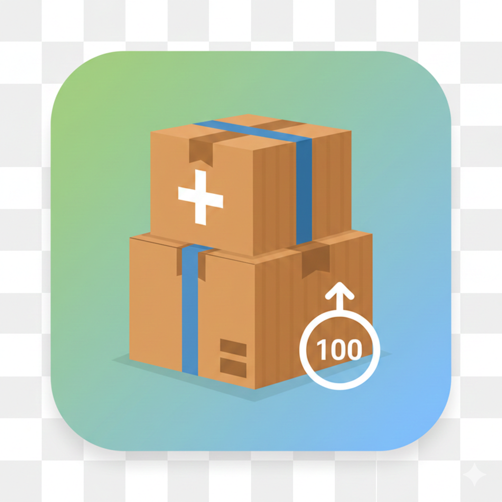

<p align="center">
  
</p>


# 📦 BoxCounterApp


**BoxCounterApp** es una herramienta profesional diseñada para el conteo logístico de cajas en tiempo real para reponedores. Enfocada en la eficiencia operativa, permite a los usuarios gestionar la reposición de cajas por turno directamente desde la interfaz de la aplicación o mediante un panel de control interactivo en la barra de notificaciones.

---

🎯 Contexto

Este proyecto surge como solución a la necesidad de reemplazar métodos manuales de conteo (papel o memoria), los cuales suelen generar errores, inconsistencias y falta de trazabilidad en procesos logísticos.

La aplicación permite mantener un registro confiable, validado y persistente del conteo de productos durante cada turno de trabajo.

---

## 🚀 Características Principales

* **Conteo en Tiempo Real:** Incremento y decremento de unidades con persistencia inmediata.
* **Panel de Control en Notificación:** Interactúa con el contador desde la pantalla de bloqueo sin necesidad de abrir la app.
* **Gestión de Turnos (Shifts):** Sistema de validación para asegurar que cada conteo pertenece a un registro activo.
* **Entrada Manual:** Soporte para edición directa de cantidades mediante diálogos con validación.
* **Seguridad:** Integración con **BiometricManager** para acciones críticas (Finalización de turno, ajustes manuales).

---

## 🛠️ Stack Técnico

Este proyecto fue construido siguiendo las mejores prácticas de desarrollo Android:

* **Lenguaje:** Java.
* **Arquitectura:** MVVM (Model-View-ViewModel).
* **Persistencia:** [Room Database](https://developer.android.com/training/data-storage/room) con patrón Singleton.
* **Concurrencia:** Manejo de hilos mediante `ExecutorService` para operaciones no bloqueantes.
* **UI Components:** LiveData, ViewModel, Material Components, ViewBinding.
* **Servicios:** Foreground Services para la persistencia del panel de notificaciones.

---

## 🏗️ Arquitectura del Proyecto

La aplicación respeta una separación estricta de responsabilidades:

1.  **UI Layer (Activities/Dialogs):** Observa los cambios mediante `LiveData`.
2.  **ViewModel Layer:** Puerta de enlace entre la UI y la lógica de negocio.
3.  **Domain/Logic Layer (`ShiftLogic`):** Encargada de las reglas de negocio y validaciones.
4.  **Data Layer (Repository/DAO):** Gestión única de la fuente de verdad (Single Source of Truth).

---

## 📸 Capturas del Sistema


---

## 📦 Instalación y Uso

1.  Clona este repositorio:
    ```bash
    git clone [https://github.com/tu-usuario/BoxCounterApp.git](https://github.com/tu-usuario/BoxCounterApp.git)
    ```
2.  Abre el proyecto en **Android Studio**.
3.  Sincroniza el proyecto con los archivos Gradle.
4.  Ejecuta en un dispositivo físico o emulador (API 26+ recomendado para Notificaciones).

---

⚠️ Limitaciones
Aplicación enfocada en uso local (sin backend ni sincronización remota)
No diseñada para operación multiusuario en tiempo real
Persistencia limitada al dispositivo

---

## 👨‍💻 Autor

**Juan Ignacio Clavería** - *Full Stack Developer*

[](https://www.linkedin.com/in/juan-ignacio-claver%C3%ADa/)
[](https://juanin92.github.io/)

> **Nota para Reclutadores:** Este proyecto demuestra habilidades en el manejo del ciclo de vida de Android, servicios en segundo plano, persistencia local robusta y sincronización de datos asíncrona.
